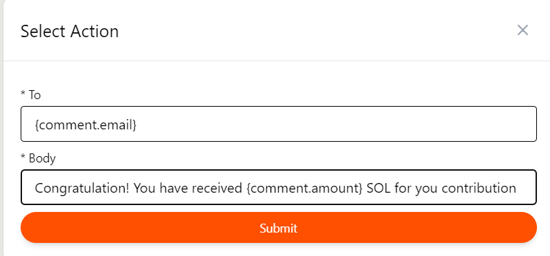
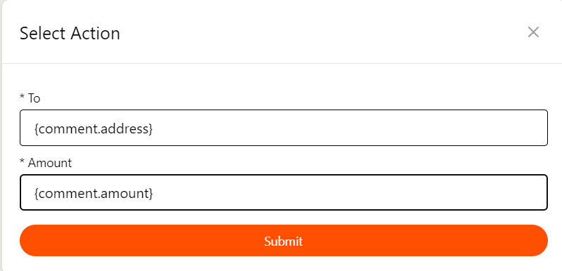
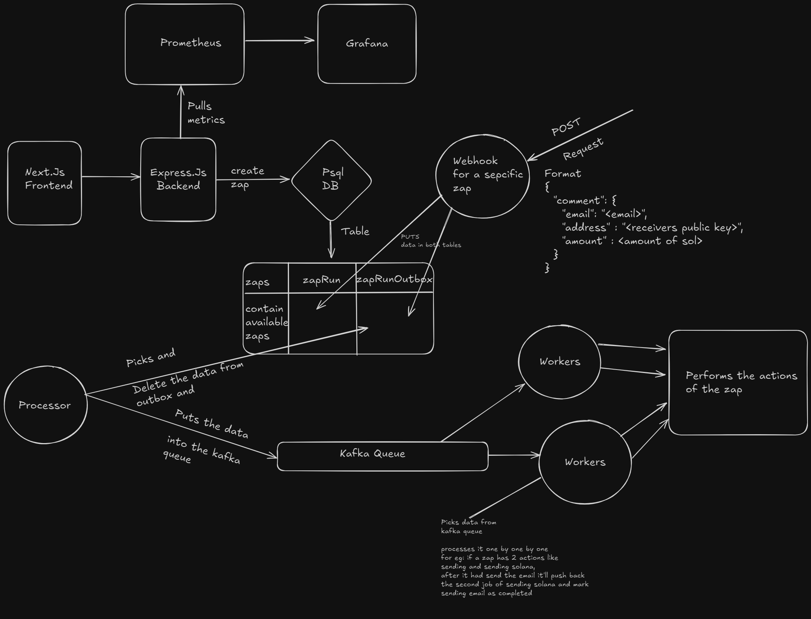

# AutomateX

AutomateX is a lightweight automation platform inspired by Zapier, enabling users to create simple automation workflows by defining triggers and actions. The core feature allows users to set up webhooks as triggers, which can then initiate actions such as sending Solana or dispatching emails when a POST request is made to the webhook. Designed for flexibility and ease of deployment, AutomateX makes it easy to extend and customize actions to suit specific automation needs, leveraging the power of serverless functions and webhooks for seamless integrations.

**_Note :- Only the frontend, primary-backend and hooks is deployed so if you try to run the project it might not run cause the processor and worker isn't deployed as they run infinitely_**

## Tech Stack

- Monorepo/Turborepo
- Typescript
- Next.Js
- Express.Js
- PostgreSQL
- Prisma ORM
- Kafka
- Docker
- CI/CD Pipeline to deploy images of sepcific apps to docker hub
- Solana RPC
- SMTP
- Prometheus
- Grafana
- Husky for pre-commit hook

## Workflow

A zap is a combination of trigger and actions, currently the application have a webhook as a trigger and the available actions are sending solana or sending the user email.
The webhook trigger accepts data in the format like

```json
{
  "comment": {
    "email": "<email>",
    "address" : "<receivers public key>",
    "amount" : <amount of sol>
  }
}
```

when creating the zap the user would be prompted to add a trigger and action when selcted email as an option they need to form in which the data will be extracted for eg :-

For email


For solana


Then it will create the appropriate zap and the webhook, which can be used as a webhook option in github and when you comment like this on github/ or any other platform where the webhook is integrated

```json
{
  "comment": {
    "email": "<email>",
    "address" : "<receivers public key>",
    "amount" : <amount of sol>
  }
}
```

It will send a post request to the webhook server which will then push data to the ZapRun and ZapRunOutbox from there the processor will pick the data from the outbox and delete from the ZapRunOutbox Table and push the data to the kafka queue and the worker will process the data either by sending Solana using Solana RPC or sending email via SMTP

Both worker and processor runs infinitely and does processing of the data

I have also used Prometheus and Grafana for monitoring the express server

Complete workflow



## Running the project locally

There is a [docker-compose.yml](./docker-compose.yml) in each of the services fill in the environment variables after that in the project's root dir run

```shell
git clone https://github.com/Ayush272002/AutomateX.git
cd AutomateX
docker-compose up
```

## Contributing

Contributions are welcome! If you have suggestions for new features, bug fixes, or improvements, please fork the repository and submit a pull request. For major changes, please open an issue first to discuss what you would like to change.

## License

This project is licensed under the MIT License - see the [LICENSE](LICENSE) file for details.

## Contact

If you have any questions or suggestions, please feel free to contact.
